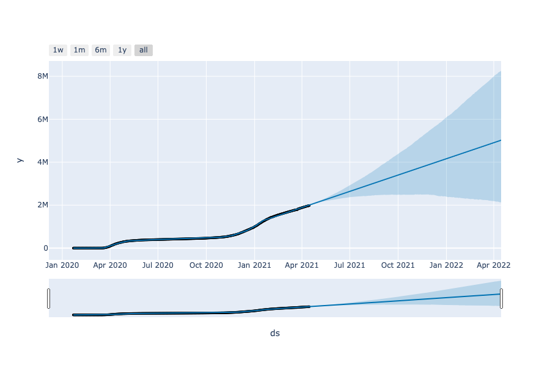
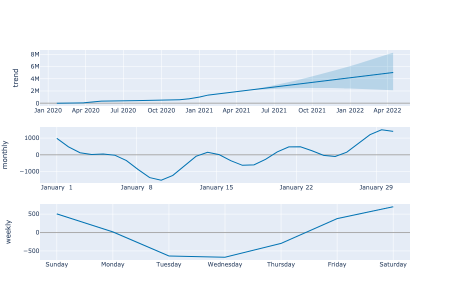

# Gap Inc. Virtual Learning Experience COVID DS Project
A project assignment by GAP Inc. during their inaugral 2021 Virtual Experience Program.

### Assignment:

Practice your data analysis, plotting, modeling, and storytelling skills by mimicking the work the Data & Analytics Team did to drive Gap Inc.’s store re-opening strategy in Q1/Q2 2020. If you know data science programming languages like Python, R, SQL, or JavaScript(to name a few), you can use those for this activity. You can also use Excel & its chart/graph functionality as well.

### Sample Viz
- Infection forecasting using Prophet

- Infection forecast trends using Prophet

### Questions:
1. The most often used metric for overall rate of spread of the disease for a particular geography is casesper capita, which is the number of cases in that region divided by the population. Please calculate theinfection rate per capita by state for June 2020 (if using data from class activity) or for June 2021 if using GitHub data.

2. Plot the infection rate by state (per capita as above) by day for 2021 for the largest 4 states in the US;Florida, California, Texas, and New York.

3. Using the infections data and recent trends in how cases are moving, please come up with amethodology for forecasting the number of cases you expect to see in these 4 states for the next 90days.

4. Compare your forecasts to the one from the Institute of Health Metrics at the University of Washington(https://covid19.healthdata.org/projections)? How are your forecasts similar or different?

### Methodology

1. I loaded time series data, on COVID infections, from Johns Hopkins public data GitHub repo:https://github.com/CSSEGISandData/COVID-19/tree/master/csse_covid_19_data/csse_covid_19_time_series

2. I performed some data wrangling using pandas on Jupyter Notebook. 

3. Answered the questions using the data.

4. Used Facebook Prophet to forecast infection numbers in question 3.

#### NOTE: This is for learning purposes and I know my processes and code could be simplified or improved to achieve the set goals above. Feel free to improve upon it!
